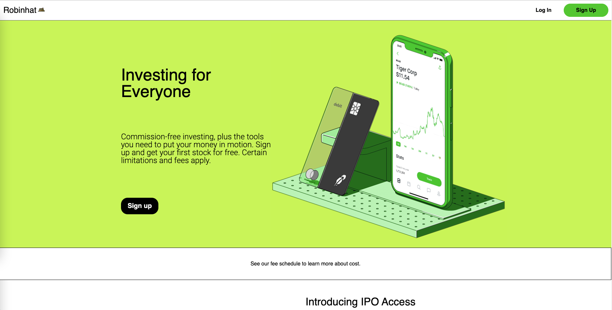
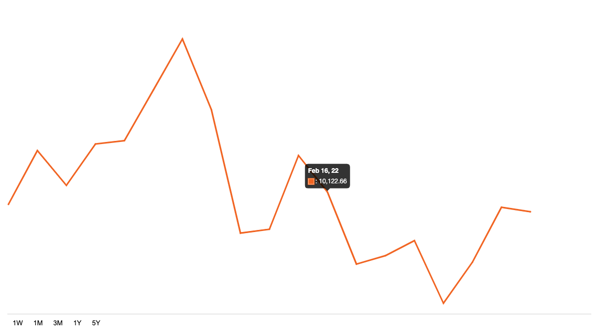
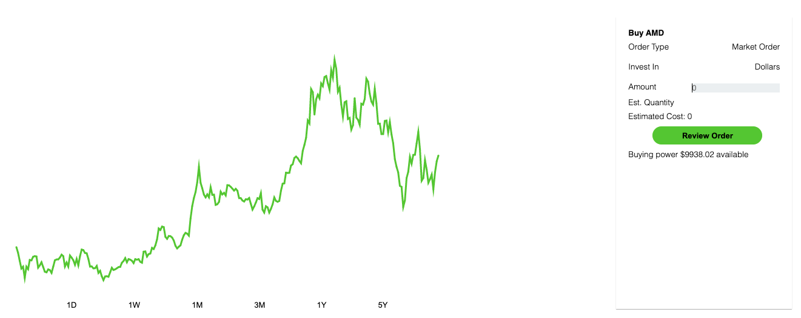
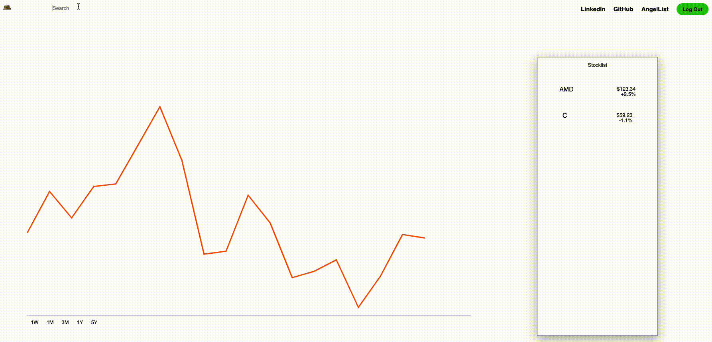
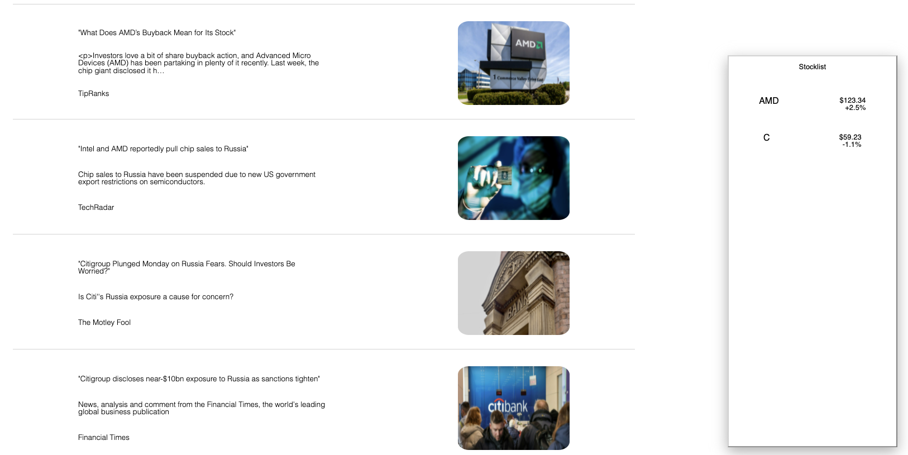

# Robinhat

[Live Link](https://robinhat-1.herokuapp.com/#/)
---

## Table of Contents
---
- [Description](#desc)
- [Technologies](#tech)
- [Core Features](#core)

<div id='desc'></div>

## Description
---



Robinhat is a clone of Robinhood, a stock/cryptocurrency trading platform that gained popularity with commission-free trading.
It promises a simple and efficient trading experience to it's users allowing searching, buying and selling.

## Technologies 
---

  - React/Redux
  - Ruby on Rails
  - JavaScript, HTML, & SCSS
  - PostgreSQL
  - Node.js
  - jQuery
  - jBuilder
  - Webpack

<div id='core'></div>

## Core Features

## Portfolio HomePage
---
The Portfolio HomePage feature consist of data visualization of users' portfolio performance 
and current price of users' stocks.


## Trade Window
---
The Trade Window feature uses CRUD function to add stocks to user portfolio


## Search Bar
---
The Search Bar feature uses lifecycle methods and selector functions for users
to search stocks by ticker symbol or company name.



### Challenge:
At first the search bar would return all relavent searches, unfiltered. Especially after entering
the first two letters, the results would cause the site to freeze.

### Solution:
The searched results were refactored to return a result only after hitting 5 or less of the most relevant searches.
```js
const filterStocks = (stockNames, query) => {
    const tickers = Object.keys(stockNames)
    const companyNames = Object.values(stockNames)
    
    if (!query) {
        return [];
    }

    const filteredTickers = tickers.filter(e => e.startsWith((query.toUpperCase())))
    const filteredTickersIndex = filteredTickers.map(e => (tickers.indexOf(e)));
    const filteredCompanyNames = filteredTickersIndex.map(e => companyNames[e])
    let finalResults = [];
    for (const element of filteredTickers){
        const shiftedCompanyName = filteredCompanyNames.shift()
        
        if (finalResults.length < 5) {
            finalResults.push(`${element}: ${shiftedCompanyName}`)
        }
    }
    return finalResults
    ;
};
```


## News Articles
---
The News Article feature dynamically fetches daily news articles relevant to the stocks 
in the window.


### Challenge:
1. I wanted news articles to be the most updated news.
2. I neeeded DRY code to make sure it's readable and clean.

### Solution:
1.  `randomRelevantNewsArticles` pushed the first two elements, which are the most 
recent articles. 
2. There was some foresight into reorganizing the data into `newsArray` also, which
 helps to allow the `map` function that is utilized later on when the articles are rendered
 out

```js
randomRelevantNewsArticles(combinedNews) {
        let newsArray = [];
        combinedNews.forEach(e => {
            if (e.length!==0){newsArray.push(e[0],e[1])}
        })
        this.setState({combinedNews:newsArray})
}

<div>{this.state.combinedNews.map((e,index) =>(
      <a href={e.url}className="newsIndividualRow"key={index}>
          <div className="newsTextArea">
              <div className="newsHeadLines">"{e.headline}"</div>
              <div className="newsSummaries"><p>{e.summary}</p></div>
              <div><p>{e.source}</p></div>
          </div>
            
      </a>
      ))}
  </div>
```
